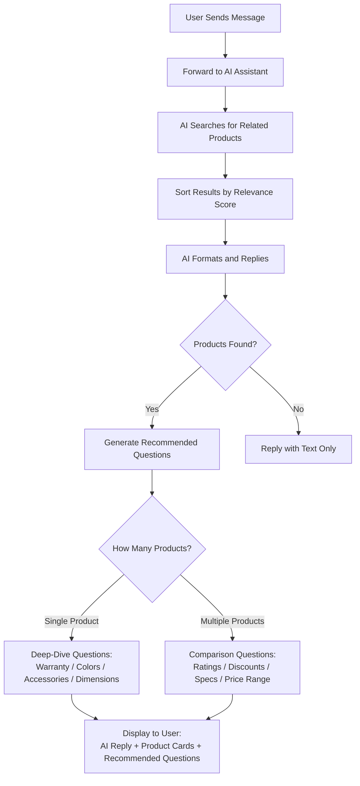
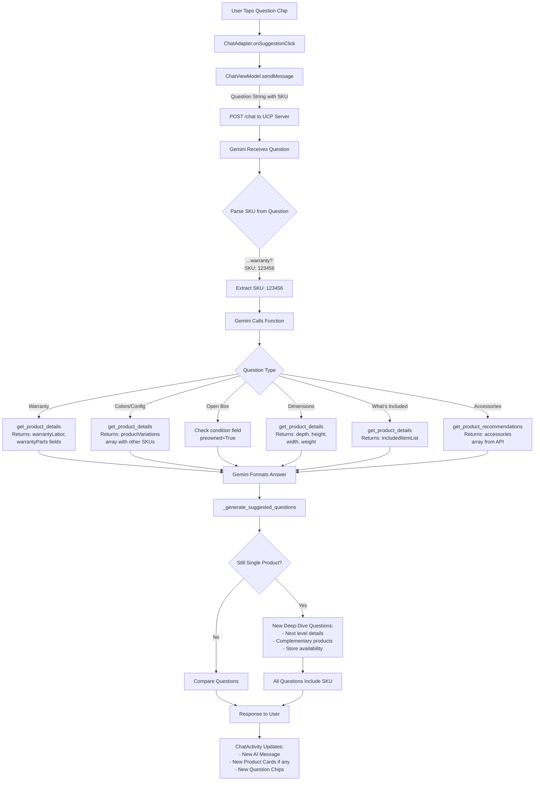

# Recommendation Flow Documentation

## Overview

This document explains the recommendation system's logic for generating suggested products and follow-up questions in response to user queries.

## Flow 1: Initial User Query → Product Recommendations + Question Chips

**Trigger**: User types a message (e.g., "I want to buy an iPhone")

### Key Logic Points

**Product Ranking** (`bestbuy_client.py`):
- Exact spec match: +100 points
- Partial match: +50 points
- Auto-sorts by relevance score

**Question Generation** (`chat_service.py::_generate_suggested_questions`):

**For Single Product**:
1. Warranty coverage (high priority for expensive items)
2. Color/configuration variants
3. Open box/refurbished deals
4. Dimensions & weight
5. What's included in box
6. Compatible accessories
7. Current special offers

**For Multiple Products**:
1. Best customer rating (if rating data exists)
2. Biggest discount (if sale data exists)
3. Category-specific specs:
   - Audio: Wired/wireless options
   - TV/Monitor: Screen size variants
   - Appliances: Capacity options
   - Laptops: Storage/screen configs
4. Color/finish options (if ≥2 colors detected)
5. Current promotions/offers
6. Accessories compatibility
7. Which items are on sale
8. Price range (min to max)
9. Free shipping availability

**SKU Injection for Single Product**:
- Questions append `(SKU: XXXXX)` 
- Gemini extracts SKU automatically → no user re-input needed

---

## Flow 2: User Clicks Question Chip → SKU-Specific Deep Dive

**Trigger**: User taps a suggested question chip

### Key Logic Points

**SKU Persistence**:
- First round: System appends `(SKU: XXXXX)` to single-product questions
- User clicks → full question string sent to server
- Gemini's system prompt instructs it to extract and use the SKU

**Function Resolution**:

| Question Type | Function Called | Data Returned |
|--------------|----------------|---------------|
| Warranty | `get_product_details` | `warrantyLabor`, `warrantyParts` |
| Colors/Variants | `get_product_details` | `productVariations` array |
| Open Box | `get_product_details` | `condition`, `preowned` flags |
| Dimensions | `get_product_details` | `depth`, `height`, `width`, `weight` |
| What's Included | `get_product_details` | `includedItemList` |
| Accessories | `get_product_recommendations` | `accessories` array |
| Store Availability | `check_store_availability` | BOPIS store list |

**Second-Level Questions**:
- Context-aware: If user asks about warranty, next chips may suggest:
  - "What protection plans are available?"
  - "Check in-store pickup availability"
  - "Show me similar products"

---

## Data-Driven Question Selection

**Priority Rules**:

1. **Always prefer questions backed by real data**
   - Example: Only ask "What colors?" if `color` field exists or multiple products have different colors
   
2. **Avoid redundant questions**
   - Product card already shows: rating badge, sale badge, price
   - Skip: "Is this on sale?" or "What's the rating?"

3. **Category-specific intelligence**
   - TV/Monitor → screen size questions
   - Audio products → wired/wireless variants
   - Appliances → capacity/size options
   - Laptops → storage/screen configs

4. **Question deduplication**
   - If user message contains "warranty", skip warranty question
   - If user message contains "dimension", skip dimension question

5. **Max 3 questions per response**
   - Most relevant questions appear first
   - User can always type custom questions

---

## Implementation Files

### Android (Kotlin)
- [ChatActivity.kt](app/src/main/java/com/bestbuy/scanner/ui/ChatActivity.kt) - Main chat interface
- [ChatAdapter.kt](app/src/main/java/com/bestbuy/scanner/ui/adapter/ChatAdapter.kt) - Displays question chips
- [ChatModels.kt](app/src/main/java/com/bestbuy/scanner/data/model/ChatModels.kt) - `suggestedQuestions` field

### UCP Server (Python)
- [chat_service.py](ucp_server/app/services/chat_service.py) - `_generate_suggested_questions()` (lines 866-1245)
- [bestbuy_client.py](ucp_server/app/services/bestbuy_client.py) - `_filter_and_rank_results()` product scoring
- [gemini_client.py](ucp_server/app/services/gemini_client.py) - Function calling orchestration

---

## Example Flow

**User Input**: "show me iphone 15 pro"

**System Response**:
- **Products**: 3 iPhone 15 Pro models (different colors)
- **Questions**:
  1. "Which of these iPhone 15 Pro has the biggest discount right now?"
  2. "What color or finish options are available for iPhone 15 Pro?"
  3. "Are there any current special offers or deals on iPhone 15 Pro?"

**User Clicks**: "What color or finish options are available for iPhone 15 Pro?"

**System Response**:
- **Message**: "The iPhone 15 Pro is available in 4 colors: Natural Titanium, Blue Titanium, White Titanium, and Black Titanium. [Details about each color...]"
- **Products**: 4 iPhone 15 Pro models (one per color)
- **New Questions** (each includes SKU):
  1. "What warranty does the iPhone 15 Pro come with? (SKU: 6487385)"
  2. "Are there open box, refurbished, or pre-owned versions of the iPhone 15 Pro available at a lower price? (SKU: 6487385)"
  3. "What are the dimensions and weight of the iPhone 15 Pro? (SKU: 6487385)"

**User Clicks**: "What warranty does the iPhone 15 Pro come with? (SKU: 6487385)"

**System Response**:
- **Message**: "The iPhone 15 Pro comes with a 1-year limited warranty covering hardware repairs and 90 days of complimentary technical support. [Extended warranty options...]"
- **New Questions**:
  1. "What comes in the box with the iPhone 15 Pro? (SKU: 6487385)"
  2. "What accessories are compatible with the iPhone 15 Pro? (SKU: 6487385)"
  3. "Are there recommended accessories for the iPhone 15 Pro? (SKU: 6487385)"

---

## Technical Notes

- **API Efficiency**: Default `max_results=5` for product search; recommendations use `pageSize=10`
- **Rate Limiting**: Best Buy API enforces 5 req/min — UCP Server's `RateLimiter` auto-throttles
- **SKU-Focus Limit**: Up to 8 SKUs extracted from AI response; all referenced product cards shown
- **No BOPIS in Questions**: Store availability questions excluded from initial generation (slow API calls)
- **Question Length**: Max 3 chips per response; questions kept concise for mobile UI
- **Multi-line Support**: `MaterialButton` with `isSingleLine=false` for long questions

